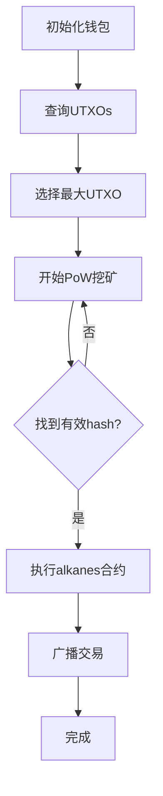

# PoW Alkane Miner 完整指南

## 📁 文件结构

```
scripts/
├── pow-alkane-miner.ts         # 主要PoW Alkane挖矿脚本
├── demo-pow-alkane.ts          # 工作流程演示脚本
├── .env.pow-alkane.example     # 环境配置模板
├── POW_ALKANE_USAGE.md         # 详细使用说明
└── README_POW_ALKANE.md        # 本文件
```

## 🚀 快速开始

### 1. 演示测试 (无需配置)

```bash
# 查看完整工作流程
npm run demo-pow-alkane

# 查看哈希计算过程
npm run demo-pow-alkane hash
```

### 2. 实际使用 (需要配置)

```bash
# 1. 复制配置模板
cp scripts/.env.pow-alkane.example .env

# 2. 编辑配置文件
nano .env

# 3. 运行PoW Alkane挖矿
npm run pow-alkane
```

## ✨ 核心功能

### 🎯 主要特性
- ✅ **自动UTXO选择**: 智能选择钱包中最大的UTXO
- ✅ **PoW挖矿**: 基于双重SHA-256的工作量证明
- ✅ **合约执行**: 使用找到的nonce自动调用alkanes合约
- ✅ **完整流程**: 一键完成从挖矿到合约执行的全流程

### 🔧 技术实现
- **哈希算法**: 双重SHA-256
- **数据格式**: Symbol + UTXO(txid+vout) + Nonce
- **合约调用**: calldata `[2, 26127, 77, nonce]`
- **字节序**: 小端序处理，大端序比较

## 📊 工作流程



### 详细步骤说明

1. **钱包初始化** (`initializeWallet`)
   - 使用助记词生成账户和签名器
   - 连接到指定网络的提供者

2. **UTXO选择** (`selectBestUtxo`)
   - 查询钱包中所有可用的UTXOs
   - 自动选择价值最大的UTXO用于挖矿

3. **PoW挖矿** (`mineNonce`)
   - 准备固定数据 (Symbol + UTXO信息)
   - 迭代nonce寻找满足难度的hash
   - 实时显示挖矿进度和算力

4. **合约执行** (`executeAlkaneContract`)
   - 构建calldata: `[2, 26127, 77, nonce]`
   - 创建protostone消息
   - 执行alkanes合约并广播交易

## 🛠️ 配置参数

### 必需配置
```bash
POW_MINER_MNEMONIC="your twelve word mnemonic phrase"
```

### 可选配置
```bash
POW_SYMBOL="TESTTOKEN"           # 挖矿符号
POW_DIFFICULTY=4                 # 难度级别 (1-6)
POW_MAX_ATTEMPTS=10000000        # 最大尝试次数
POW_FEE_RATE=10                  # 交易费率
NETWORK_TYPE=regtest             # 网络类型
POW_ALKANE_RECEIVER=             # 接收地址(可选)
LOG_LEVEL=info                   # 日志级别
```

## 📈 性能指标

### 基准性能
- **算力**: ~20 kH/s (现代CPU)
- **内存使用**: <50MB
- **难度4**: 通常1-5分钟
- **网络调用**: 最少2次

### 难度对照表
| 难度 | 期望尝试次数 | 预计时间 | 适用场景 |
|-----|-------------|----------|----------|
| 1   | ~16         | 秒级     | 快速测试 |
| 2   | ~256        | 秒级     | 开发调试 |
| 3   | ~4,096      | 分钟级   | 轻量挖矿 |
| 4   | ~65,536     | 分钟级   | 标准挖矿 |
| 5   | ~1,048,576  | 小时级   | 高强度挖矿 |

## 🔍 合约详情

### Calldata结构
```javascript
[2, 26127, 77, nonce]
```

- `2`: 操作码
- `26127`: 参数1
- `77`: 参数2  
- `nonce`: PoW挖矿找到的随机数

### Protostone配置
```javascript
{
  protocolTag: 1n,
  edicts: [],
  pointer: 0,
  refundPointer: 0,
  calldata: encipher([2, 26127, 77, nonce])
}
```

## 📝 使用示例

### 基础使用
```bash
# 1. 设置环境变量
POW_MINER_MNEMONIC="word1 word2 ... word12"
POW_SYMBOL="MYTOKEN"
POW_DIFFICULTY=4

# 2. 运行挖矿
npm run pow-alkane
```

### 高级配置
```bash
# 设置更高难度和费率
POW_DIFFICULTY=5
POW_FEE_RATE=20
POW_MAX_ATTEMPTS=50000000

# 指定接收地址
POW_ALKANE_RECEIVER=bc1p...your_address

# 运行
npm run pow-alkane
```

## 🔧 故障排除

### 常见问题

1. **"POW_MINER_MNEMONIC not found"**
   ```bash
   # 确保.env文件存在且正确配置
   cp scripts/.env.pow-alkane.example .env
   nano .env  # 设置助记词
   ```

2. **"No UTXOs found"**
   ```bash
   # 检查钱包余额和网络设置
   # 确保在正确的网络上有足够的比特币
   ```

3. **挖矿时间过长**
   ```bash
   # 降低难度或增加最大尝试次数
   POW_DIFFICULTY=3
   POW_MAX_ATTEMPTS=50000000
   ```

4. **合约执行失败**
   ```bash
   # 检查网络连接和费率设置
   # 确保钱包有足够余额支付交易费
   ```

### 调试技巧
```bash
# 启用详细日志
LOG_LEVEL=debug npm run pow-alkane

# 测试网络连接
npm run test-utxo

# 检查PoW算法
npm run demo-pow-alkane hash
```

## 🔒 安全考虑

### 重要提醒
- ⚠️ **助记词安全**: 绝不要将助记词提交到版本控制
- ⚠️ **网络选择**: 测试优先使用regtest，生产环境谨慎使用mainnet
- ⚠️ **费率设置**: 设置合理费率避免过高费用
- ⚠️ **余额管理**: 确保钱包有足够余额支付交易费用

### 最佳实践
- 🔒 使用环境变量存储敏感信息
- 🔒 在测试网络上充分测试
- 🔒 监控交易状态和费用消耗
- 🔒 定期备份钱包助记词

## 📚 相关命令

```bash
# 主要命令
npm run pow-alkane              # 运行PoW Alkane挖矿
npm run demo-pow-alkane         # 工作流程演示

# 辅助命令  
npm run demo-pow-alkane hash    # 哈希计算演示
npm run test-utxo               # UTXO查询测试
npm run demo-utxo               # UTXO选择演示
```

## 🎯 总结

PoW Alkane Miner是一个完整的解决方案，它：

1. **简化操作**: 一个命令完成从挖矿到合约执行
2. **智能选择**: 自动选择最优UTXO
3. **高效挖矿**: 优化的PoW算法实现
4. **安全可靠**: 完整的错误处理和日志记录

适合需要进行alkanes合约调用并且希望通过PoW验证的应用场景。

---

**版本**: 1.0.0  
**创建**: 2024年  
**维护**: Oyl SDK Team  
**许可**: MIT License